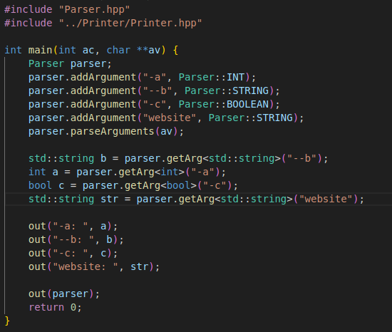
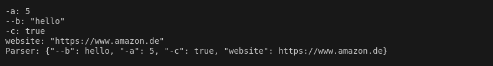

# Parser Library

The Parser library provides a simple yet extensible framework for parsing command-line arguments in C++. It supports options and positional arguments with default values and type enforcement.

## Features
- Argument Types: Supports boolean, integer, and string argument types.

- Positional Arguments: Handles positional arguments that are required in a specific order.

- Optional Arguments: Handles optional arguments that can be specified with flags (e.g., --flag or -f).

- Default Values: Allows setting default values for arguments if they are not provided.

- Error Handling: Provides robust error handling for invalid arguments and types.

- Output Formatting: Easily retrieve arguments in both raw and string formats.

## How to Use

### 1. Add Arguments
Use addArgument to register arguments with their name, type, and optional default value.

Parser parser;
parser.addArgument("--verbose", Parser::BOOLEAN); // Boolean flag
parser.addArgument("input", Parser::STRING);      // Positional argument
parser.addArgument("--timeout", Parser::INT, 30); // Integer option with default value

### 2. Parse Command-Line Arguments
Call parseArguments with the command-line arguments (argv):

char* argv[] = {"program", "--verbose", "file.txt", "--timeout", "60"};
parser.parseArguments(argv);

### 3. Access Parsed Values
Retrieve parsed arguments using getArg:

bool verbose = parser.getArg<bool>("--verbose");
std::string input = parser.getArg<std::string>("input");
int timeout = parser.getArg<int>("--timeout");

Get a map of all parsed arguments:

auto args = parser.getArgs(); // Returns std::map<std::string, std::variant<int, bool, std::string>>

auto args = parser.getArgs(); // Returns std::map<std::string, std::string>

## Example:

by running "./program --b hello -a 5 -c https://www.amazon.de" we obtain:

To use this out function refer to the README.md file in MyCppLib/Printer/

## Notes:

- getArg throws a runtime error exception if the element is not found

- if a positional argument is registered to the parser with addArgument without any default value, not providing any value for it to the parser will throw an error.

- a boolean argument has a default value of false, and when the boolean is passed as argument its value becomes true.

- setting a default value to every argument can be practical when repetitively testing code with the same input, as it alleviates the need to pass arguments to the program.
