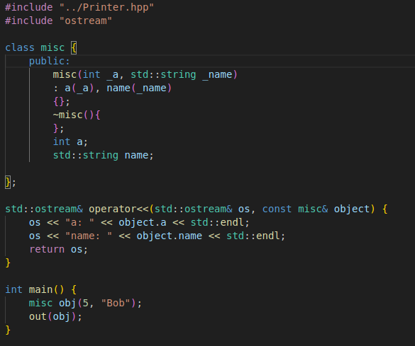
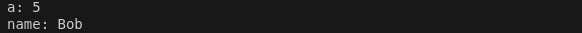

# Printer.hpp

  Usage: import Printer.hpp into your project and call out() or fout(), pass variables and objects as parameters to the out function.
  
  - out:
  out() takes an arbitrary amount of arguments that can be scalar types, containers or custom objects, some of the less common containers have not been included, out() prints a new line after every parameter, except for c strings.
  
  - fout:
  fout() works like out(), except that calling Out::setFoutFd() will redirect its output making it easier to store text in debug log files, the method setFoutFd will not redirect the output of out, so that fout() can be used to effortlesly output into a file while out() is being used to redirect to std out in the same program.

  These function are calling write from unistd to output data, be mindful when redirecting STDOUT_FILENO.
  For custom objects std::cout is used and requires operator << overload.

  - Printer::print()
  For more output customization Printer::print() can be called, various types are handled by print() but it can only take one element at a time to print. It has two params sep and newLine, sep is a string used to define the separator used to separate elements when printing containers of size > 1, by default teh separator is ", ". The param newLine can be set to true or false, true will output a newLine after printing the entire container, false will not, newLine defaults to true. The functions out and fout take an arbitrary amount of arguments and then call Printer::print() on each one of those arguments.

### Implementation for custom objects:

- To output custom objects it is required that the user has implemented an operator << overload to std::ostream for his object's type.

OUTPUT: 

