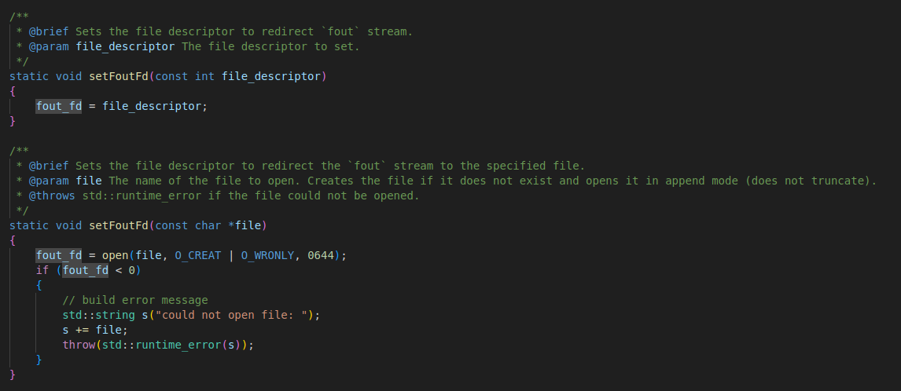
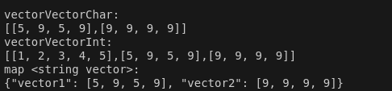

# Printer.hpp

This is guide was not updated function names have changed, now use Out::stdOut, Out::stdErr, Out::fout, and Out::setFoutFile. You may use "using namespace Out".

## Usage

  - requires c++17 or later
  - import Printer.hpp into your project and call out() or fout(), pass variables and objects as parameters to the out function.
  
### - out:
  
  out() takes an arbitrary amount of arguments that can be scalar types, containers or custom objects, some of the less common containers have not been included, out() prints a new line after every parameter, except for c strings.
  
  These function are calling write from unistd to output data, be mindful when redirecting STDOUT_FILENO.
  For custom objects std::cout is used and requires operator << overload.
  By default a newline is printed after every element except for c strings (char *), allowing the user to display a debug message specific to a variable on the same line as the variable for better readability, ex:

output: 

### - fout:
  fout() works like out(), except that calling Printer::setFoutFd() will redirect its output making it easier to store text in debug log files, the method setFoutFd will not redirect the output of out, so that fout() can be used to effortlesly to output into a file while out() is being used to redirect to std out in the same program. The function setFoutFd may take an int file_descriptor corresponding to an open file, or else it may take a file name either as a c_string or as a c++ string object. If it takes a filename than it will create it if it doesn't exist and append to it, not overwriting its current content.

### - Printer::print()
  For more output customization Printer::print() can be called, various types are handled by print() but it can only take one element at a time to print. It has two params sep and newLine, sep is a string used to define the separator used to separate elements when printing containers of size > 1, by default the separator is ", ". The param newLine can be set to true or false, true will output a newLine after printing the entire container, false will not, newLine defaults to true. The functions out and fout take an arbitrary amount of arguments and then call Printer::print() on each one of those arguments.

## Implementation for nested containers:
  The output function is recursively calling itself to print the elements of a container so in the case of containers it will recursively call nested containers.

## Implementation for custom objects:

- To enable output for custom objects, the user must implement an operator<< overload for std::ostream specific to the object's type.

OUTPUT:

### - A template print function for custom object pointers has been implemented. It will print the object provided the appropriate std::ostream operator<< overload is defined. This allows the out function to handle polymorphic objects seamlessly.

OUTPUT:

